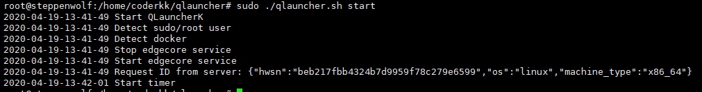
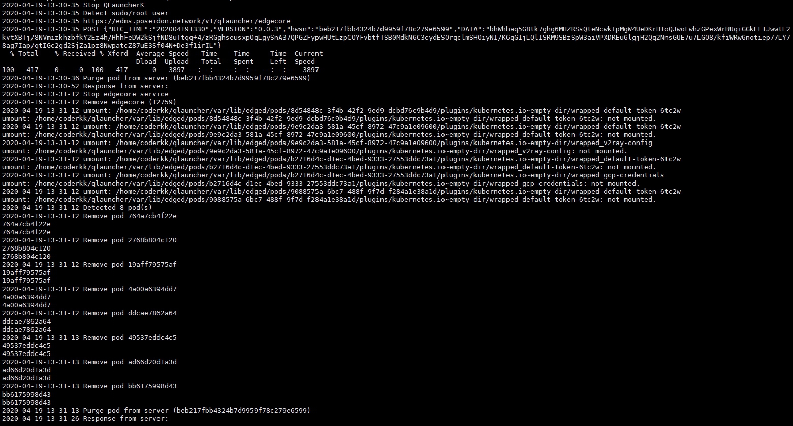
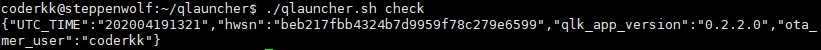
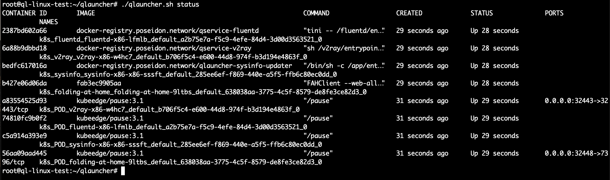
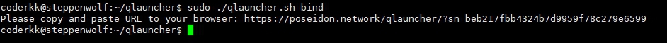

<h1 align="center">QLauncher on Linux</h1>

# What is QLauncher
Poseidon Miners could install **QLauncher** to their IoT devices as nodes of Poseidon Network. After QLauncher installed, when **Service Providers** pay Cryptocurrency for using **QServices**, Poseidon Miners could earn **QQQ tokens** in realtime via **PoD**, which is a mechanism for recording usage and earnings of node resources (such as Bandwidth, CPU, Storage) to Ethereum.

If you'd like to become one of Poseidon Miners, QLauncher is built for you to add your devices as nodes of Poseidon Network.

You can visit [About Poseidon](https://poseidon.network) for more information.

# Linux & Docker versions supported by QLauncher
### Linux
* Ubuntu 18.04.4
* CentOS 8
* RHEL 8

### Docker
* Docker Version 19.03.6


# How QLauncher Works
### Features
* Poseidon k8s cluster : Collect & dispatch device resources (such as Storage, Bandwidth, CPU) through Poseidon k8s cluster
* system analyzer : Analyze resources shared by the device
* life cycle manager : Check if the device works properly
* OTA : Painless update QLauncher


# Installation
### Install Docker
* Ubuntu
```
sudo su
apt-get update
apt-get install docker.io
```

* Other Linux Platforms
Please refer to [Docker Website](https://docs.docker.com/engine/install/)

### Install QLauncher
```
mkdir ~/qlauncher
wget https://github.com/poseidon-network/qlauncher-linux/releases/download/0.2.4.0/ql-linux.tar.gz -O app.tar.gz
tar -vxzf app.tar.gz -C ~/qlauncher/
```

# Usage
### Start QLauncher
```cd ~/qlauncher
./qlauncher.sh start
```
You'll get the following output:
```
2020-04-19-13-26-24 Start QLauncherK
2020-04-19-13-26-24 Detect sudo/root user
2020-04-19-13-26-24 Detect docker
2020-04-19-13-26-24 Stop edgecore service
2020-04-19-13-26-24 Start edgecore service
2020-04-19-13-26-24 Request ID from server: {"hwsn":"beb217fbb4324b7d9959f78c279e6599","os":"linux","machine_type":"x86_64"}
2020-04-19-13-26-37 Start timer
```



### Stop QLauncher
```
cd ~/qlauncher
sudo ./qlauncher.sh stop
```
You'll get the following output:
```
## Stop server
    cd ~/qlauncher
    sudo ./qlauncher.sh stop
    
    ### Output
    2020-04-19-13-30-35 Stop QLauncherK
    2020-04-19-13-30-35 Detect sudo/root user
    2020-04-19-13-30-35 https://edms.poseidon.network/v1/qlauncher/edgecore
    2020-04-19-13-30-35 POST {"UTC_TIME":"202004191330","VERSION":"0.0.3","hwsn":"beb217fbb4324b7d9959f78c279e6599","DATA":"bhWhhaq5G8tk7ghg6MHZRSsQteNcwk+pMgW4UeDKrH1oQJwoFwhzGPexWrBUqiGGkLF1JwwtL2kvtXBTj/8NVmizkhzbfkY2Ez4h/HhhFeDW2kSjfND8uTtqq+4/zRGghseusxpOqLgySnA37QPGZFypwHUtLzpCOYFvbtfTSB0MdkN6C3cydESOrqclmSHOiyNI/K6qG1jLQlISRM9SBzSpW3aiVPXDREu6lgjH2Qq2NnsGUE7u7LGO8/kfiWRw6notiep77LY78ag7Iap/qtIGc2gd2SjZa1pz8NwpatcZ87uE3Sf04N+De3f1irIL"}
      % Total    % Received % Xferd  Average Speed   Time    Time     Time  Current
                                     Dload  Upload   Total   Spent    Left  Speed
    100   417    0     0  100   417      0   3897 --:--:-- --:--:-- --:--:--  3897
    2020-04-19-13-30-36 Purge pod from server (beb217fbb4324b7d9959f78c279e6599)
    2020-04-19-13-30-52 Response from server:
    2020-04-19-13-31-12 Stop edgecore service
    2020-04-19-13-31-12 Remove edgecore (12759)
    2020-04-19-13-31-12 umount: /home/coderkk/qlauncher/var/lib/edged/pods/8d54848c-3f4b-42f2-9ed9-dcbd76c9b4d9/plugins/kubernetes.io~empty-dir/wrapped_default-token-6tc2w
    umount: /home/coderkk/qlauncher/var/lib/edged/pods/8d54848c-3f4b-42f2-9ed9-dcbd76c9b4d9/plugins/kubernetes.io~empty-dir/wrapped_default-token-6tc2w: not mounted.
    2020-04-19-13-31-12 umount: /home/coderkk/qlauncher/var/lib/edged/pods/9e9c2da3-581a-45cf-8972-47c9a1e09600/plugins/kubernetes.io~empty-dir/wrapped_default-token-6tc2w
    umount: /home/coderkk/qlauncher/var/lib/edged/pods/9e9c2da3-581a-45cf-8972-47c9a1e09600/plugins/kubernetes.io~empty-dir/wrapped_default-token-6tc2w: not mounted.
    2020-04-19-13-31-12 umount: /home/coderkk/qlauncher/var/lib/edged/pods/9e9c2da3-581a-45cf-8972-47c9a1e09600/plugins/kubernetes.io~empty-dir/wrapped_v2ray-config
    umount: /home/coderkk/qlauncher/var/lib/edged/pods/9e9c2da3-581a-45cf-8972-47c9a1e09600/plugins/kubernetes.io~empty-dir/wrapped_v2ray-config: not mounted.
    2020-04-19-13-31-12 umount: /home/coderkk/qlauncher/var/lib/edged/pods/b2716d4c-d1ec-4bed-9333-27553ddc73a1/plugins/kubernetes.io~empty-dir/wrapped_default-token-6tc2w
    umount: /home/coderkk/qlauncher/var/lib/edged/pods/b2716d4c-d1ec-4bed-9333-27553ddc73a1/plugins/kubernetes.io~empty-dir/wrapped_default-token-6tc2w: not mounted.
    2020-04-19-13-31-12 umount: /home/coderkk/qlauncher/var/lib/edged/pods/b2716d4c-d1ec-4bed-9333-27553ddc73a1/plugins/kubernetes.io~empty-dir/wrapped_gcp-credentials
    umount: /home/coderkk/qlauncher/var/lib/edged/pods/b2716d4c-d1ec-4bed-9333-27553ddc73a1/plugins/kubernetes.io~empty-dir/wrapped_gcp-credentials: not mounted.
    2020-04-19-13-31-12 umount: /home/coderkk/qlauncher/var/lib/edged/pods/9088575a-6bc7-488f-9f7d-f284a1e38a1d/plugins/kubernetes.io~empty-dir/wrapped_default-token-6tc2w
    umount: /home/coderkk/qlauncher/var/lib/edged/pods/9088575a-6bc7-488f-9f7d-f284a1e38a1d/plugins/kubernetes.io~empty-dir/wrapped_default-token-6tc2w: not mounted.
    2020-04-19-13-31-12 Detected 8 pod(s)
    2020-04-19-13-31-12 Remove pod 764a7cb4f22e
    764a7cb4f22e
    764a7cb4f22e
    2020-04-19-13-31-12 Remove pod 2768b804c120
    2768b804c120
    2768b804c120
    2020-04-19-13-31-12 Remove pod 19aff79575af
    19aff79575af
    19aff79575af
    2020-04-19-13-31-12 Remove pod 4a00a6394dd7
    4a00a6394dd7
    4a00a6394dd7
    2020-04-19-13-31-12 Remove pod ddcae7862a64
    ddcae7862a64
    ddcae7862a64
    2020-04-19-13-31-13 Remove pod 49537eddc4c5
    49537eddc4c5
    49537eddc4c5
    2020-04-19-13-31-13 Remove pod ad66d20d1a3d
    ad66d20d1a3d
    ad66d20d1a3d
    2020-04-19-13-31-13 Remove pod bb6175998d43
    bb6175998d43
    bb6175998d43
    2020-04-19-13-31-13 Purge pod from server (beb217fbb4324b7d9959f78c279e6599)

```




### Verify Installation Success
```
cd ~/qlauncher
./qlauncher.sh check
```
If QLauncher is installed successfully, you will get the following output:
```
{"UTC_TIME":"202004191321",
"hwsn":"bebxxxxxxxxxxxxx99",
"qlk_app_version":"0.2.2.0",
"ota_vmer_user":"coderkk"}
```




### Check running Qservices on QLauncher
```
cd ~/qlauncher
root@ql-linux-test:~/qlauncher# ./qlauncher.sh status
```

You'll get the following output:
```
CONTAINER ID        IMAGE                                                        COMMAND                  CREATED             STATUS              PORTS                      NAMES
2387bd602a66        docker-registry.poseidon.network/qservice-fluentd            "tini -- /fluentd/en…"   29 seconds ago      Up 28 seconds                                  k8s_fluentd_fluentd-x86-lfmlb_default_a2b75e7a-f5c9-4efe-84d4-3d00d3563521_0
6a88b9dbbd18        docker-registry.poseidon.network/qservice-v2ray              "sh /v2ray/entrypoin…"   29 seconds ago      Up 28 seconds                                  k8s_v2ray_v2ray-x86-w4hc7_default_b706f5c4-e600-44d8-974f-b3d194e4863f_0
bedfc617016a        docker-registry.poseidon.network/qlauncher-sysinfo-updater   "/bin/sh -c /app/ent…"   29 seconds ago      Up 28 seconds                                  k8s_sysinfo_sysinfo-x86-x86-sssft_default_285ee6ef-f869-440e-a5f5-ffb6c80ec0dd_0
b427e06d06da        fab3ec9905aa                                                 "FAHClient --web-all…"   29 seconds ago      Up 28 seconds                                  k8s_folding-at-home_folding-at-home-9ltbs_default_638038aa-3775-4c5f-8579-de8fe3ce82d3_0
a83554525d93        kubeedge/pause:3.1                                           "/pause"                 31 seconds ago      Up 29 seconds       0.0.0.0:32443->32443/tcp   k8s_POD_v2ray-x86-w4hc7_default_b706f5c4-e600-44d8-974f-b3d194e4863f_0
74810fc9b0f2        kubeedge/pause:3.1                                           "/pause"                 31 seconds ago      Up 29 seconds                                  k8s_POD_fluentd-x86-lfmlb_default_a2b75e7a-f5c9-4efe-84d4-3d00d3563521_0
c5a914a393e9        kubeedge/pause:3.1                                           "/pause"                 31 seconds ago      Up 29 seconds                                  k8s_POD_sysinfo-x86-x86-sssft_default_285ee6ef-f869-440e-a5f5-ffb6c80ec0dd_0
56aa09aad445        kubeedge/pause:3.1                                           "/pause"                 31 seconds ago      Up 29 seconds       0.0.0.0:32448->7396/tcp    k8s_POD_folding-at-home-9ltbs_default_638038aa-3775-4c5f-8579-de8fe3ce82d3_0
root@ql-linux-test:~/qlauncher#
```




### Monitor QLauncher via QQQ App
#### Download QQQ App and register your account
* Download QQQ App on [App Store](https://apps.apple.com/tt/app/qqq-app/id1468063328)
* Download QQQ App on [Google Play](https://play.google.com/store/apps/details?id=network.poseidon.qqq.app)

#### Get QRcode
```
cd ~/qlauncher
./qlauncher.sh bind
```
You will get a page link as below :
```
Please copy and paste URL to your browser: https://poseidon.network/qlauncher/?sn=beb217fbb4324b7d9959f78c279e6599
```



#### Scan the QRcode in the page via QQQ app


# User Support
* [GitHub issues](https://github.com/poseidon-network/qlauncher-linux/issues) for bug reports and feature requests.
* Tweet directly to @QQQToken
